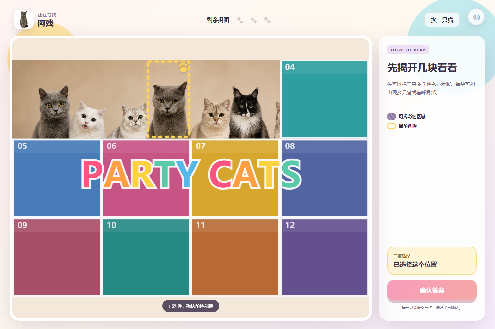

# Party Cats｜婚礼寻猫互动游戏

一款为婚礼现场设计的离线 H5 大屏互动游戏。玩家翻开 4 块彩色蒙版，观察合影中的猫咪，先口头说出昵称，再点击对应猫咪；游戏公布真实昵称，由现场主持人判断是否答对。



## 在线体验

[打开在线游戏](https://shabririri418-cell.github.io/party-cats-wedding-game/)，无需登录和后端服务。

## 核心玩法

1. 打开游戏后直接进入一张被 12 块彩色蒙版覆盖的猫咪合影。
2. 玩家依次翻开 4 块蒙版。
3. 玩家观察露出的猫咪，口头说出其中一只猫的昵称。
4. 玩家点击对应猫咪并确认。
5. 游戏弹窗公布所选猫咪的真实昵称。
6. 点击“下一题”进入另一组合影。

## 项目特点

- 23 只真实猫咪素材。
- 10 道固定合影题，每题均包含全部 23 只猫。
- 每题采用 8 / 8 / 7 三排布局。
- 230 个猫咪点击区域经过人工逐一校准。
- 10 题洗牌轮换，不会连续重复。
- Canvas 绘制蒙版、选中框和交互状态。
- 支持浏览器运行及 Windows 离线一键启动。
- 不需要数据库、账号系统或联网业务。

## 本地运行

```powershell
python -m http.server 4173
```

然后打开 `http://127.0.0.1:4173`。Windows 用户也可以双击 `双击启动游戏.bat`。

## 目录结构

- `index.html`：页面结构。
- `styles.css`：视觉样式与响应式布局。
- `app.js`：题库、Canvas 交互和游戏状态。
- `performance-loader.js`：题图按需加载、预热和失败重试。
- `assets/cats/`：猫咪透明素材。
- `assets/questions/`：10 道正式题图及人工校准映射。
- `smoke-test.cjs`：Playwright 浏览器验收脚本。
- `qa/`：关键流程验收截图。

## 验收范围

- 10/10 道题图片与映射均可加载。
- 每题包含 23 个唯一猫咪身份。
- 第 4 块蒙版揭开前不能选择猫咪。
- 确认选择后显示对应猫咪昵称。
- 两轮题袋均完整覆盖 10 题，且无相邻重复。

## 开源许可

源代码采用 [MIT License](LICENSE)。仓库中的猫咪照片、合影题图和其他图片素材不包含在 MIT 授权范围内，详见 [ASSETS-LICENSE.md](ASSETS-LICENSE.md)。复用项目时，请替换为你拥有合法授权的图片素材。
